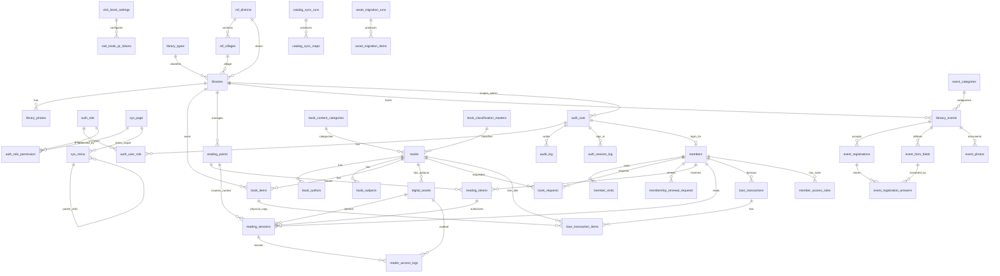

# ERD Pustaka Digital Rembang

Update: 2026-08-07

Dokumen ini menjadi pegangan relasi data aplikasi `pustaka`. INLISLite tetap menjadi sumber/staging data, tetapi schema operasional aplikasi berada di database `pustaka`.

## Prinsip Desain Data

- `books` adalah induk bibliografi untuk semua buku.
- Ebook/PDF adalah aset opsional di `digital_assets`. Tidak semua buku punya ebook.
- Semua data hasil migrasi menyimpan jejak sumber melalui `source_id`, `source_system`, atau tabel mapping.
- Data operasional baru tidak ditulis balik ke INLISLite.
- Hak akses, menu, dan halaman disimpan di database agar modul baru dapat mengikuti RBAC tanpa ubah kode besar.
- File PDF asli berada di storage non-public. Browser hanya menerima PDF utuh jika aset memang `download_allowed`; selain itu browser menerima gambar halaman hasil render.
- Kunjungan dihitung lintas kanal: fisik, monitor pelayanan, QR, pojok baca, dashboard member, dan akses digital.

## Diagram Relasi Utama

## Rumpun Tabel

### 1. Auth, RBAC, dan Sidebar

Tabel utama:

- `auth_user`: akun login admin dan member.
- `auth_role`: tipe user, misalnya `SUPERADMIN`, `ADMIN`, `USER`, dan role baru seperti `ADMIN_DESA`.
- `auth_user_role`: assignment akun ke role.
- `auth_role_permission`: izin role terhadap halaman/aksi.
- `auth_user_permission_override`: pengecualian izin per user.
- `sys_page`: registry halaman dan permission key.
- `sys_menu`: struktur sidebar berbasis database.
- `sys_sidebar_favorite`: shortcut sidebar user.
- `audit_log`: jejak aksi penting.
- `auth_session_log`: riwayat login/logout/session.

Catatan relasi:

- Satu user dapat punya beberapa role.
- Satu role dapat punya banyak permission.
- Sidebar mengikuti `sys_menu` dan target halaman mengikuti `sys_page`.
- Admin lokal memakai scope `library_id` pada `auth_user`.

### 2. Wilayah dan Perpustakaan GIS

Tabel utama:

- `ref_districts`: kecamatan Rembang dengan kode `33.17.xx`.
- `ref_villages`: Desa / Kelurahan.
- `library_types`: jenis perpustakaan.
- `libraries`: profil perpustakaan lengkap, koordinat, radius, dan status.
- `library_photos`: foto/galeri perpustakaan.

Catatan relasi:

- Satu kecamatan punya banyak desa/kelurahan.
- Satu perpustakaan berada pada satu kecamatan dan opsional satu desa/kelurahan.
- Satu perpustakaan dapat punya banyak foto, eksemplar, titik pojok baca, event, dan admin scoped.

### 3. Katalog, Eksemplar, dan Ebook

Tabel utama:

- `books`: bibliografi utama dari INLISLite dan input manual.
- `book_authors`: penulis/kontributor terurai.
- `book_subjects`: subjek terurai.
- `book_items`: eksemplar fisik/koleksi.
- `book_content_categories`: kategori isi versi Pustaka, misalnya fiksi, nonfiksi, karya ilmiah.
- `book_classification_masters`: klasifikasi isi/DDC versi kurasi.
- `catalog_highlights`: pengaturan admin untuk buku/kategori pilihan yang tampil di dashboard pemustaka.
- `digital_assets`: file PDF/ebook dan kebijakan akses.
- `catalog_sync_runs`: riwayat batch sinkron katalog.
- `catalog_sync_maps`: peta ID sumber INLISLite ke ID aplikasi.

Catatan relasi:

- `books` adalah parent semua metadata buku.
- `book_items` merepresentasikan copy fisik dan harus terkait ke `books`.
- `digital_assets` merepresentasikan ebook/PDF dan wajib terkait ke `books`.
- `catalog_highlights.target_type = book` mengarah ke `books`; `target_type = category` mengarah ke `book_content_categories`.
- Highlight aktif mempertimbangkan `is_active`, `starts_at`, `ends_at`, dan `sort_order`.
- Kategori isi dan klasifikasi isi adalah master kurasi aplikasi, bukan master mentah INLISLite.
- Kategori isi dan klasifikasi tidak dipaksa parent-child karena satu klasifikasi bisa relevan untuk beberapa payung pencarian.

### 4. Membership dan Pendaftaran Online

Tabel utama:

- `members`: profil member aplikasi.
- `member_registration_requests`: antrean pendaftaran online dan berkas.
- `membership_renewal_requests`: antrean perpanjangan membership.
- `book_requests`: request/reservasi buku dari katalog publik.
- `member_sync_runs`: riwayat sinkron member.

Catatan relasi:

- Member hasil migrasi dibuatkan akun `auth_user` role `USER`.
- Username member memakai NIK jika tersedia.
- Password awal/reset standar: `perpus2026`.
- Pendaftar online masuk status pending dulu, lalu admin verifikasi sebelum akun aktif.
- Kartu digital dapat aktif, diblokir, atau kedaluwarsa dengan alasan operasional.

### 5. Layanan Harian dan Kunjungan

Tabel utama:

- `member_visits`: semua kunjungan lintas kanal.
- `member_access_rules`: hak layanan/hak pinjam kategori dan lokasi.
- `loan_transactions`: header peminjaman fisik dari INLISLite.
- `loan_transaction_items`: detail item peminjaman.
- `transaction_sync_runs`: riwayat sinkron transaksi harian.
- `visit_kiosk_settings`: pengaturan monitor buku tamu.
- `visit_kiosk_qr_tokens`: QR dinamis monitor pelayanan.

Kanal kunjungan:

- `library_guestbook`: pengunjung fisik non-member.
- `service_monitor`: member dicatat dari monitor pelayanan.
- `qr_checkin`: member scan QR monitor pelayanan.
- `reading_point`: check-in GPS pojok baca.
- `member_dashboard`: akses dashboard member.
- `digital_access`: akses fasilitas baca digital yang dapat mengurangi kuota.

Catatan relasi:

- `member_visits` dapat berisi kunjungan member atau kunjungan non-member/rombongan.
- `visitor_count` dipakai untuk rombongan agar data jumlah orang tetap masuk tanpa input satu per satu.
- Laporan harus menghitung total orang, bukan hanya jumlah baris kunjungan.

### 6. Reader Aman dan Pojok Baca

Tabel utama:

- `reading_points`: titik pojok baca digital, koordinat, radius, jam aktif, kuota.
- `reading_tokens`: token/kuota baca member.
- `reading_sessions`: sesi baca ebook.
- `reader_access_logs`: audit halaman, stream, blokir, dan rate limit.

Aturan token:

- Member dapat membaca dari mana saja selama token tersedia.
- Reader `location_only` mengecek GPS lebih dulu.
- Jika membaca dari lokasi Pojok Baca atau Perpustakaan Daerah yang tervalidasi GPS, akses dibuka tanpa wajib token aktif dan kuota tidak berkurang.
- Jika membaca dari luar lokasi bebas, token aktif wajib tersedia dan kuota berkurang.
- Jika token habis, member perlu login/absen di Perpustakaan Daerah untuk pembaruan token.

Aturan file:

- `download_allowed`: PDF utuh boleh di-stream.
- Selain `download_allowed`: PDF asli tidak boleh dikirim ke browser, hanya halaman render PNG dengan watermark.
- Semua akses reader dicatat di `reader_access_logs`.

### 7. Event Literasi

Tabel utama:

- `event_categories`: kategori event seperti Bedah Buku, Storytelling Anak, Literasi Digital, Kunjungan Sekolah, dan lainnya.
- `literacy_events`: agenda literasi, mode lokasi, jadwal, poster, kuota, mode pendaftaran, dan status publikasi.
- `event_form_fields`: field tambahan yang diatur admin per event.
- `event_registrations`: pendaftaran peserta, status verifikasi, tiket, dan token attendance.
- `event_registration_answers`: jawaban peserta atas field tambahan per event.
- `event_photos`: dokumentasi foto event.

Catatan relasi:

- Event bisa dimiliki Perpusda atau perpustakaan jejaring.
- Form pendaftaran bisa berbeda per event melalui `event_form_fields`.
- QR attendance memakai token pada `event_registrations.attendance_token`.
- Fase berikutnya perlu UI dokumentasi foto, sertifikat, dan laporan event.

### 8. Sinkronisasi dan Migrasi Aset

Tabel utama:

- `catalog_sync_runs`
- `catalog_sync_maps`
- `member_sync_runs`
- `transaction_sync_runs`
- `asset_migration_runs`
- `asset_migration_items`
- `inlislite_master_references`

Catatan relasi:

- Semua proses sync harus idempotent: aman dijalankan berulang.
- `*_sync_runs` menyimpan batch, mode, jumlah data, error, dan waktu proses.
- `catalog_sync_maps` menjaga relasi source-target katalog dan eksemplar.
- `asset_migration_items` menyimpan status file copied/missing/failed.
- `inlislite_master_references` menyimpan label master INLISLite agar data lama tidak tampil sebagai angka mentah.

## Batas Modul Samping

Tabel `learn_*` dan `quiz_*` ada di database saat ini sebagai modul pembelajaran/kuis yang terpisah. Modul tersebut tidak menjadi bagian inti ERD Pustaka Digital tahap ini, kecuali nanti diputuskan sebagai fitur engagement literasi.

## Aturan Integritas Data

- Jangan hapus data hasil sinkronisasi secara fisik saat source hilang. Tandai sebagai nonaktif/archived agar aman untuk audit.
- Jangan overwrite field kurasi lokal dari sinkronisasi INLISLite, terutama:
  - `books.content_category_id`
  - `books.content_classification_id`
  - `books.cover_local_path` jika sudah dikurasi manual
  - `digital_assets.*`
  - status kartu dan alasan blokir member
  - password dan status akun lokal
- Semua upload PDF manual harus masuk `storage/ebooks/manual`, bukan `assets/uploads`.
- Semua mirror aset INLISLite yang perlu dibawa pindah server berada di `assets/uploads/inlislite`, tetapi folder upload tetap tidak masuk Git.
